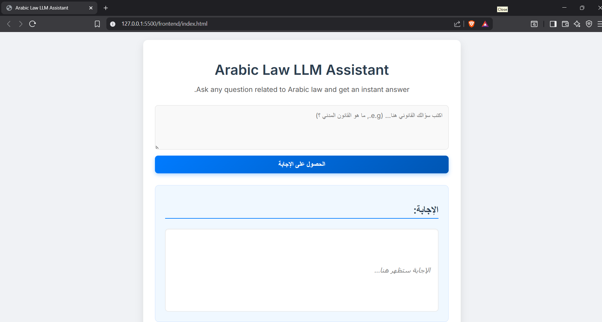

# ⚖️ Arabic Law LLM Inference Application

This project is a full-stack web application that deploys a fine-tuned Large Language Model (LLM) trained on Arabic legal data. It enables users to interact with the model via a simple web interface.

- **Backend:** Built using FastAPI for efficient and scalable API services.
- **Frontend:** Simple UI using HTML, CSS, and JavaScript.
- **Model:** Fine-tuned Arabic LLM with LoRA adapters.

---

## 🚀 Features

- Query the Arabic Law LLM via a web interface.
- Support for LoRA adapter or full model inference.
- Lightweight, fast deployment with Uvicorn and FastAPI.

---

This project includes fine-tuning the [https://huggingface.co/datasets/openai/MMMLU)](https://huggingface.co/datasets/openai/MMMLU) dataset on Arabic legal topics using a Large Language Model.

## ⚙️ Setup and Installation

### 1. Clone the Repository

```bash
git clone https://github.com/MohammedTawfikEldeeb/Arabic-Law-LLM-Assistance.git
cd Arabic-Law-LLM-Assistance
```

### 2. Prerequisites

- Python 3.12 or higher
- `uv` or `pip` for dependency management
- Git

---

## 🖥️ Backend Setup

1. Navigate to the `backend` directory:

```bash
cd backend
```

2. Install the required dependencies (recommended: use a virtual environment):

```bash
# Using uv
uv pip install -r requirements.txt

# Or using pip
pip install -r requirements.txt
```

---

## 🏃 Running Locally

Make sure you are inside the `backend` directory:

```bash
uvicorn main:app --host 0.0.0.0 --port 8000 --reload
```
Then open `index.html`

and ask your quesition and get answer


---

## 🧠 Model

You can use either the merged full model or just the adapter depending on your resource constraints:

1. **Merged Model on Hugging Face:**  
   [https://huggingface.co/Mohamed453/Arabic-Law-Merged](https://huggingface.co/Mohamed453/Arabic-Law-Merged)

2. **LoRA Adapter on Hugging Face:**  
   [https://huggingface.co/Mohamed453/Arabic-Law-LoRA](https://huggingface.co/Mohamed453/Arabic-Law-LoRA)


